<p align="center">
  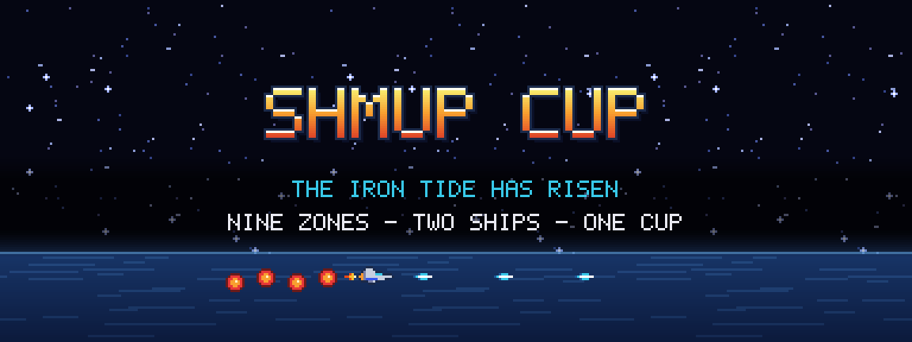
</p>

<p align="center">
  <b>A horizontal shoot-'em-up for the television.</b><br>
  Nine zones, two ships, sixteen routes and a boss at the end of every one of them —
  in TypeScript, at 60 frames a second, on a TV remote.
</p>

---

Shmup Cup is a side-scrolling shooter in the spirit of the 16-bit arcade classics: a fixed
384×216 playfield upscaled to whole pixels, a power meter you spend by hand, options that trail
behind your ship, telegraphed lasers, and a `WARNING!!` before every boss. It was written for
**Samsung TVs and Smart Monitors**, where the only controller is the remote — so the whole game is
playable with four directions and one button — and it also runs on **LG webOS TVs**, in a
**browser**, and as a **desktop app**.

Everything in it is original: the art is drawn by committed generator scripts, the music and sound
effects are synthesised from parameter files at load time, and the simulation is deterministic
enough that a whole run fits in a shareable text string.

| | |
|---|---|
| 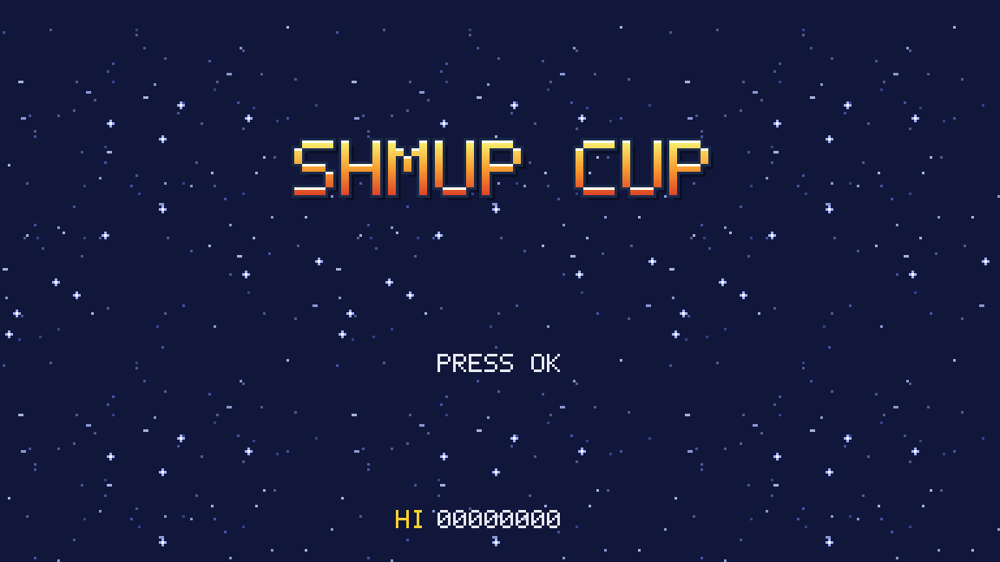 | 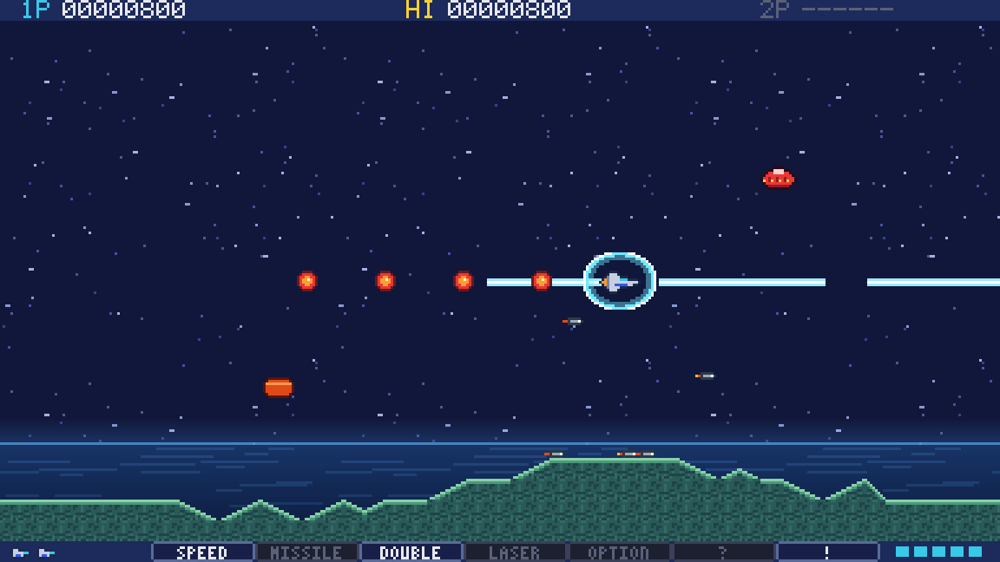 |
| 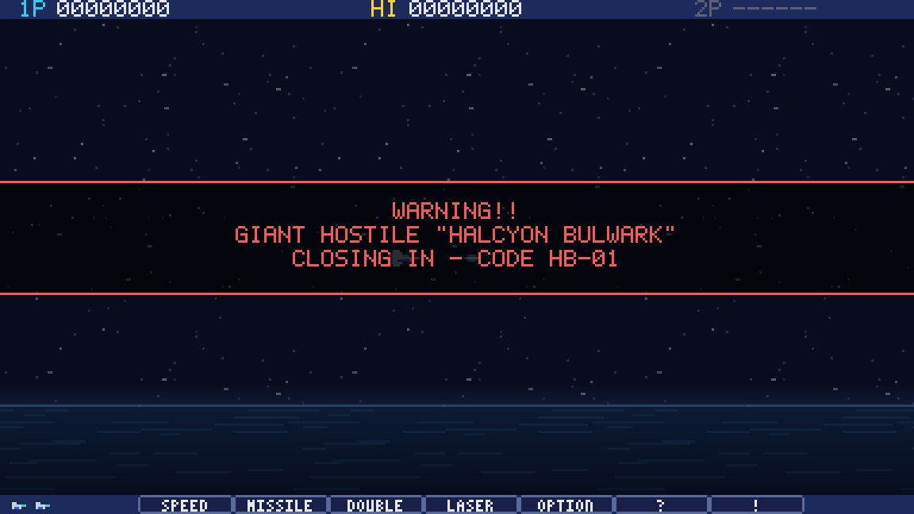 | 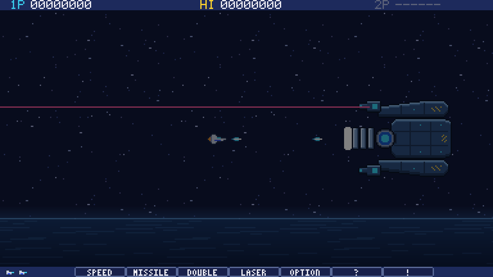 |

---

## The game

### Two ships, two ways to get stronger

|  |  |
|---|---|
| 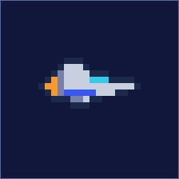 | **KESTREL** flies the **power meter**: capsules move a highlight along `SPEED · MISSILE · DOUBLE · LASER · OPTION · ? · !`, and you spend it when the slot you want is lit. Six speed levels, four Options, and a loadout you choose before the run. |
| 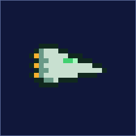 | **MANTA** flies **Direct mode**: no meter at all. Six colours of item take effect the instant you touch them, two nine-level weapon families climb as you collect, and its Arm shield is the only thing in the game that survives hitting the rock. |

Full field guide: **[arsenal.md](docs/client/arsenal.md)** — every weapon, Option type, shield and
item, with pictures.

### Nine zones, five per run

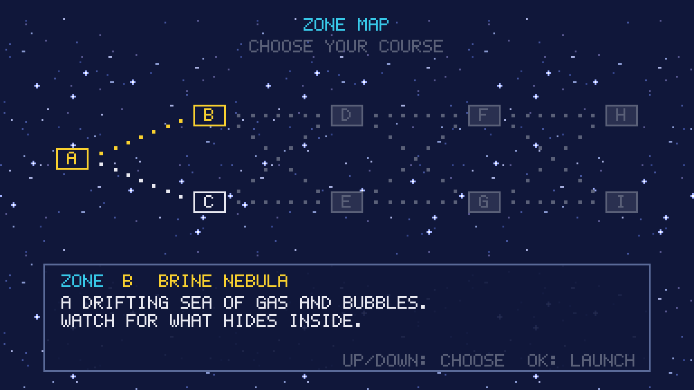

A run is five zones across a branching map — **A** → **B**|**C** → **D**|**E** → **F**|**G** →
**H**|**I**, sixteen routes in all — and which finale you reach decides which of the five endings
you get. Each zone brings its own terrain, its own hazards and its own boss.

| | | |
|---|---|---|
| **A · AZURE VERGE** | The rim of the home system |  |
| **B · BRINE NEBULA** | A sea of gas, bubbles and a mechanical fish | 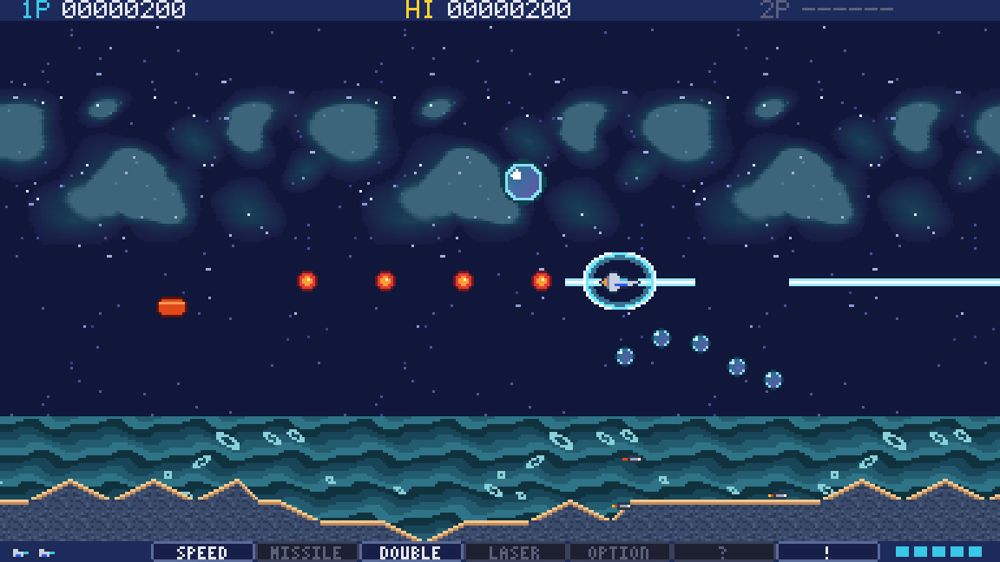 |
| **C · DUNE EXPANSE** | Sand worms under twin suns | 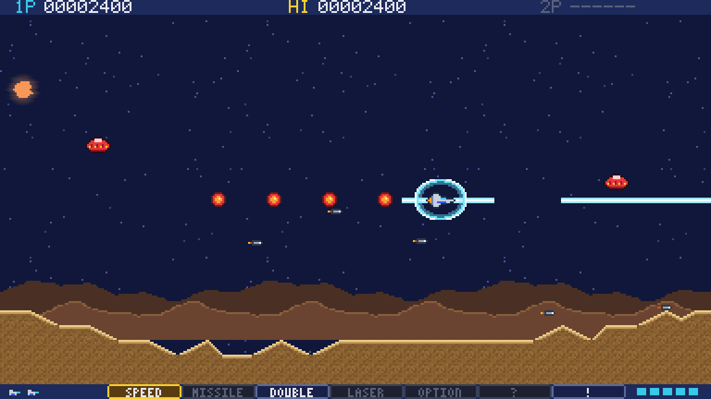 |
| **D · MAGMA DEEP** | Erupting peaks, then the caves and the brick maze | 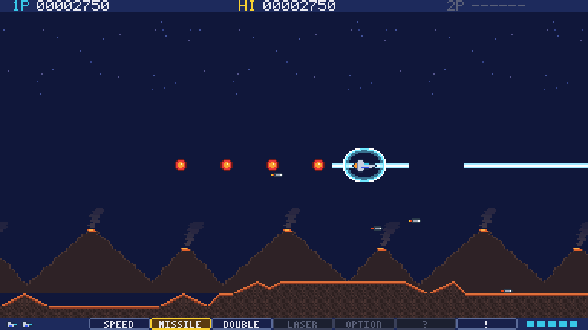 |
| **E · TEMPEST RIDGE** | A storm, and enemies from behind | 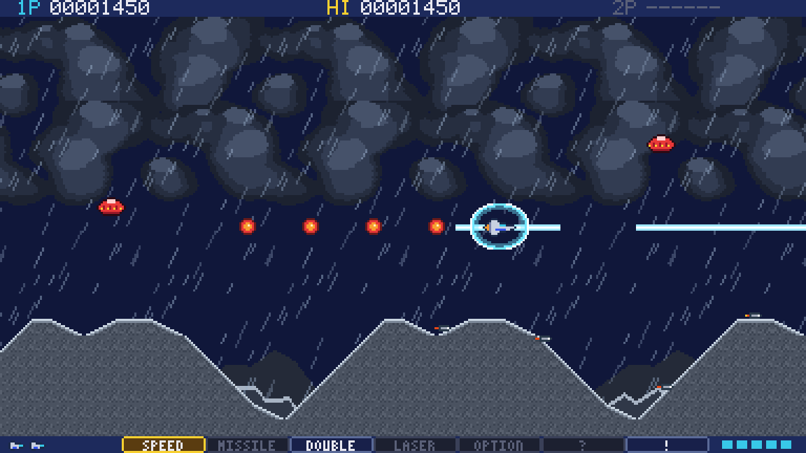 |
| **F · CELL VAULT** | Living walls that grow back | 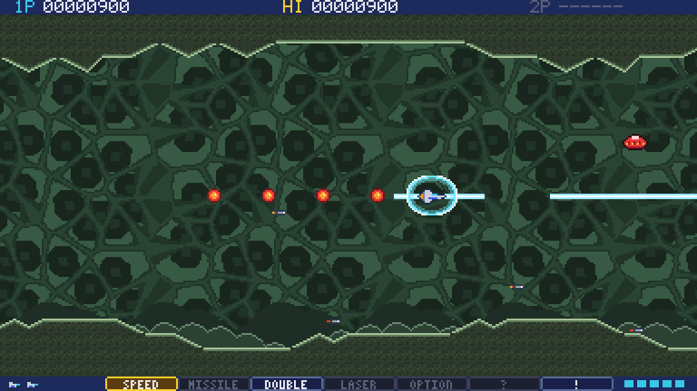 |
| **G · PRISM LABYRINTH** | Crystal corridors and cubes that build walls | 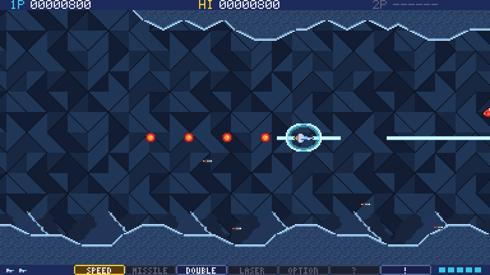 |
| **H · IRON CITADEL** | The fortress, its parade of echoes and its master | 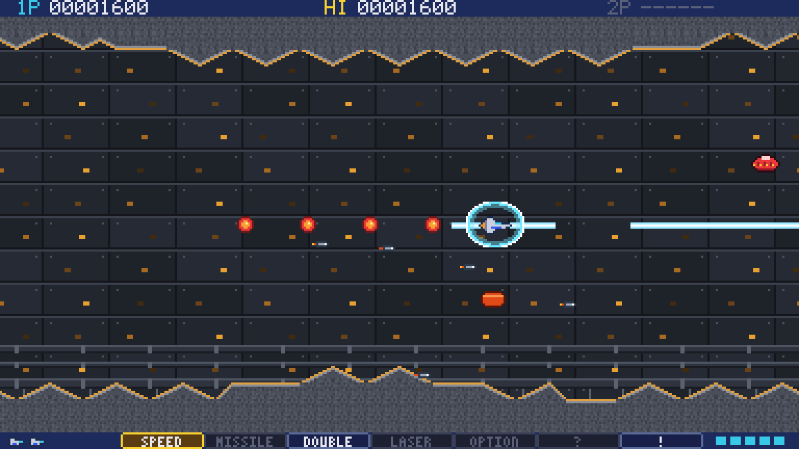 |
| **I · ABYSSAL THRONE** | Board the flagship before it dives | 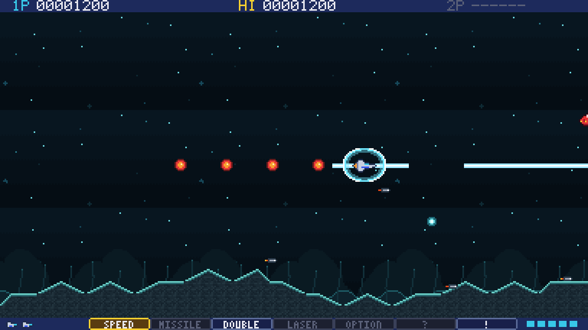 |

Each zone ends with a tally — kills, time, bonuses — and then the map, where you choose where to go
next.

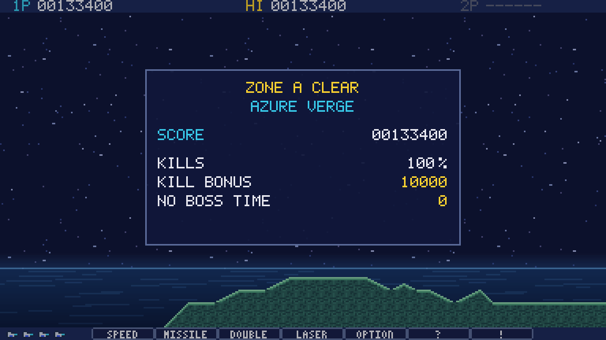

Two hidden bonus stages are tucked behind zones B and G, and the last zone ends with an escape
sequence through a collapsing corridor.

### Bosses

| 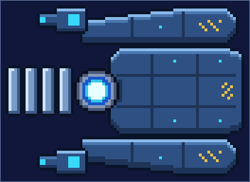 | 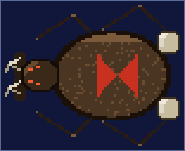 |
|---|---|
| **HALCYON BULWARK** — four plates in front of a core | **SANDGRAVE WIDOW** — break the fangs first |

Bosses are trees of up to sixteen parts, each with its own hit points, hurtbox and weak-point
rule — armour that clinks, cores that only open after their plates are gone, parts a boss holds
open while it attacks — and up to eight phases that change how it fights as you take it apart.
There are mid-bosses that arrive without a siren, a raid you fly *along* while the camera follows
it, twin bosses that share the screen, and a final boss inside another boss.

Every enemy and every boss, with art and a paragraph each:
**[bestiary.md](docs/client/bestiary.md)**.

### Everything else that is in there

- **Two players at once.** Player 2 joins with START on a pad — or shares the keyboard — with
  their own meter, ship, lives and score, and a HUD that splits to fit.
- **Difficulty and rank.** Easy / Normal / Hard / Arcade change lives, continues, aim precision
  and bullet speed; on top of that a hidden **rank** climbs with how well you are doing and makes
  the game answer in kind.
- **An arcade front end.** Leave the title alone and it plays an attract loop: a computer-played
  demo of a zone, the high-score tables, the story crawl. Finish a game well and you type your
  initials with the arrows.
- **Practice, sound test, and EXTRA** — boss rush, a caravan score attack against the clock, and
  an arcade loop that keeps going with the difficulty climbing.
- **Replays.** Every run is recorded, can be played back at ×1 / ×2 / ×4, and can be copied to the
  clipboard as text and pasted back in on another machine.
- **Assists,** for players who want them: slower game speed, invincibility, option recovery — all
  of them flagged on the replay, none of them hidden.
- **Scoring with teeth:** cancelled bullets become point items that fly to whoever earned them,
  graze pays, and a milking cap keeps the tricks honest.

### Options and accessibility

Three pages of settings, all saved, all reachable with the remote: volumes; **CONTROLS** — autofire
always / toggle / hold, fire rate, SOCD, remote debounce, **rebinding for keys and pads with
conflict detection**, and a live input test; **DISPLAY** — four bullet palettes, **three of them
colour-blind sets** with shape-coded centres, scale mode, screen shake off, **reduced flashing**, a
visible hitbox, the boss HP bar, CRT and scanline filters, ultra-wide and classic 4:3 windows with
lit side panels; and **GAME** — difficulty, lives, death penalty, Auto Power-Up, pickup magnet, and
a **one-button preset** that turns the whole game into "hold nothing, press nothing".

The game speaks **English, Español and ニホンゴ** — the Japanese in katakana, the way the arcade
machines wrote it. (The Spanish and Japanese texts are placeholders that no native speaker has read
yet.)

---

## Where it runs

| Target | Notes |
|---|---|
| **Samsung TV / Smart Monitor** (Tizen 5.5+) | The one it was written for: a `.wgt` package, Chromium 69, one classic ES2018 script inside a size budget, remote-first controls |
| **LG webOS TV** (5.0+) | The same game as an `.ipk`; Chromium 68 is the real engine floor the code is written against |
| **Browser** | Vite dev server and a static build; the fastest way to try it |
| **Desktop** (Windows / macOS / Linux) | An Electron app with file saves, a remembered window and installers — plus an optional Steamworks layer |

---

## Quick start

Prerequisites: **Node 24.15+** and **pnpm 12**. The supported range is `^24.15.0 || >=26` — Node 22
and the odd majors are out, because the allocation-guard tests are calibrated on Node 24's V8.

```sh
pnpm install
pnpm dev            # http://localhost:5173
```

Then press **Enter** five times — `PRESS OK`, `1 PLAYER`, `NORMAL`, the ship, `START` — and you are
flying zone A. Arrows or WASD move, the gun is always firing, **Enter** or **C** takes a power-up,
**Esc** pauses. `F1`–`F8` open the developer tools in a dev build.

Useful query parameters: `?stage=zone-f` to start in any zone, `?loadout=full` to start fully
powered, `?skip=boss` to jump to the boss, `?profile=keyboard-remote-emulation` to feel what the TV
remote feels like, `?profile=keyboard-split` for two players on one keyboard.

```sh
pnpm lint && pnpm typecheck && pnpm test && pnpm build   # the full gate
pnpm test:e2e         # real browsers (Playwright); --project=chromium or --project=firefox for one engine
                      # once: pnpm exec playwright install --with-deps chromium firefox
pnpm content:check    # validate every JSON in content/ against the schemas
pnpm assets           # rebuild the sprite atlas from the art sources
pnpm docs:images      # redraw the sprite and boss plates in docs/images/
pnpm docs:screens     # recapture docs/images/screens/ by playing the real game headlessly
                      # (build it first: pnpm turbo run build:test --filter=@shmup/web)
pnpm bench            # tick-time, zone stress, a 30-minute soak and a render bench
pnpm golden:update    # re-bless the golden replays after an intended simulation change
```

Building for a device:

```sh
pnpm --filter @shmup/tizen build      # Samsung .wgt + size-budget check
pnpm --filter @shmup/webos build      # LG webOS .ipk
pnpm --filter @shmup/electron package # desktop installers
```

Installing on a TV, step by step: **[install-on-tv.md](docs/client/install-on-tv.md)** ·
**[webos.md](docs/client/webos.md)** · desktop: **[desktop-app.md](docs/client/desktop-app.md)**.

---

## How it is built

- **A pure, deterministic core.** `@shmup/core` is platform-agnostic TypeScript with no DOM, no
  clocks and no `Math.random` — not even `Math.sin`, which is not specified to the last bit across
  engines. It uses committed trig tables and a seeded RNG instead, so the same inputs produce the
  same game on a TV, in Node and in two different browsers. That is what makes replays, the golden
  regression tests and lockstep co-op possible at all.
- **Nothing allocates in the hot path.** The tick and the frame run without creating a single
  object: struct-of-array pools, reused output objects, event rings of plain numbers, and
  allocation-guard tests that fail the build when a byte creeps back in. Garbage collection is what
  a 60 Hz TV notices first.
- **The game is data.** Stages, enemies, bosses, weapons, bullet patterns, particles, sounds,
  music, input profiles, the campaign map and every UI string are validated JSON under
  [`content/`](content/README.md). Bullet patterns are a small compiled DSL — no `eval` anywhere.
- **The art and audio are code.** Sprites are pixel maps and seeded procedural generators packed
  into an atlas by a committed script; sound effects are synth parameter sets and the music is chip
  songs, rendered deterministically at load. A real artist can replace any frame by name.
- **Written for Chromium 68.** The TV engine floor is checked by lint, by an API scan over every
  shipped source tree, and by browser tests that boot the actual TV bundles.
- **PixiJS v8 for pixels only.** WebGL1 first, one 384×216 render target, integer upscale, and a
  renderer that never creates a Pixi object during a frame.

Deeper: **[architecture.md](docs/dev/architecture.md)** ·
**[conventions.md](docs/dev/conventions.md)** ·
**[api-reference.md](docs/dev/api-reference.md)**.

---

## Repository layout

A pnpm workspace (`packages/*`, `apps/*`) driven by Turborepo. Full annotated tree:
[`docs/dev/repo-layout.md`](docs/dev/repo-layout.md).

| Path | What |
|---|---|
| [`packages/core`](packages/core/README.md) | The deterministic simulation: the World and its tick pipeline, every game system, the scene stack, the canvas UI kit and HUD, saves, replays, the `Platform` interface |
| [`packages/render-pixi`](packages/render-pixi/README.md) | The PixiJS v8 renderer: sprite batches, terrain and parallax, particles, shake / flash / dim, the Mode-7 floor, the CRT pass, the debug overlay |
| [`packages/audio-web`](packages/audio-web/README.md) | Web Audio: the deterministic synth, the SFX voice manager, looping music with fades and ducking |
| [`packages/input-web`](packages/input-web/README.md) | Keyboard, Samsung remote and gamepads → action snapshots, with profiles, debounce, SOCD and rebinding |
| [`packages/shell`](packages/shell/README.md) | The shared browser host: boot and loading, the error screen, the frame loop, event dispatch, dev tools |
| [`apps/web`](apps/web/README.md) · [`apps/tizen`](apps/tizen/README.md) · [`apps/webos`](apps/webos/README.md) · [`apps/electron`](apps/electron/README.md) | The four hosts |
| [`content/`](content/README.md) | The game itself, as JSON |
| [`assets/`](assets/README.md) | Art sources (pixel maps, fonts) and the generated atlas |
| [`scripts/`](scripts/README.md) | The asset pipeline, the doc-image generators, the Tiled importer and the rest of the tooling |
| [`test/`](test/README.md) | Integration tests, golden replays, the playtest bot, benchmarks and the Playwright suite |
| [`docs/`](docs/README.md) | Player docs (`client/`) and developer docs (`dev/`) |
| [`tools/input-probe`](tools/input-probe/README.md) | A standalone diagnostic app for measuring a real TV's remote and display |

---

## Documentation

**For players and testers**

| Page | |
|---|---|
| [preview-build.md](docs/client/preview-build.md) | What is in the build and what to look at |
| [bestiary.md](docs/client/bestiary.md) | Every enemy and boss, with art |
| [arsenal.md](docs/client/arsenal.md) | Ships, weapons, Options, shields, items |
| [controls.md](docs/client/controls.md) | Remote, keyboard and gamepad |
| [extra-modes-and-replays.md](docs/client/extra-modes-and-replays.md) | Boss rush, caravan, arcade loops, replays, assists |
| [visual-and-mechanic-extras.md](docs/client/visual-and-mechanic-extras.md) | The CRT pass, aspect modes, graze, the black-hole bomb |
| [install-on-tv.md](docs/client/install-on-tv.md) · [webos.md](docs/client/webos.md) · [desktop-app.md](docs/client/desktop-app.md) | Getting it onto a device |
| [debug-tools.md](docs/client/debug-tools.md) | The developer tools in a debug build |

**For contributors** — [`docs/dev/`](docs/dev/) has a page per system: the
[architecture](docs/dev/architecture.md), the [engine foundations](docs/dev/engine-foundations.md),
the [content format](docs/dev/content-data.md), the [asset pipeline](docs/dev/asset-pipeline.md),
the [World and its tick](docs/dev/sim-world.md), [stages](docs/dev/stage-runtime.md),
[enemies](docs/dev/enemies-and-behaviors.md), the [pattern DSL](docs/dev/pattern-dsl.md),
[bosses](docs/dev/advanced-bosses.md), [scenes and UI](docs/dev/scenes-and-ui.md),
[audio](docs/dev/audio.md), [saves and options](docs/dev/saves-and-options.md),
[debugging and replays](docs/dev/debug-and-replays.md), and
[building, testing and deploying](docs/dev/build-test-deploy.md).

---

## Status

Version **1.0.0-rc.1** — a feature-complete release candidate. Everything described on this page is
implemented, tested and playable from the title screen to the credits.

What is *not* done is everything that needs hardware, an account or a person: the game has never
been installed on the Samsung monitors it was written for, never run on an LG set, never spoken to
Steam and never been submitted to a store, and its art, music and the Spanish and Japanese texts
are placeholders made by the build rather than by an artist, a composer or a native speaker.

All of it is listed in one place, grouped by what each item blocks:
**[docs/client/outstanding-work.md](docs/client/outstanding-work.md)**.

---

## License

[MPL-2.0](LICENSE). Original names, art and music only.
