# Arsenal — ships, weapons and power-ups

> TWO PROTOTYPE FIGHTERS REMAIN — KESTREL AND MANTA. FLY THROUGH NINE ZONES. FIND THE HEART OF
> THE TIDE. BRING THE CUP HOME, PILOT.

Everything you fly and everything you shoot with. The pictures are the game's own sprites, drawn
from the art sources by `pnpm docs:images`; the screens are real captures of the game running.

| | |
|---|---|
| Everything that shoots back | [`bestiary.md`](bestiary.md) |
| Buttons, remotes and pads | [`controls.md`](controls.md) |
| Assists, replays, boss rush and the caravan | [`extra-modes-and-replays.md`](extra-modes-and-replays.md) |

---

## The two ships

You choose one on **SHIP SELECT**, after the difficulty menu. They do not share a single rule
about getting stronger.

| | | |
|---|---|---|
|  | **KESTREL** six speed levels · power meter | The prototype interceptor. Everything it gains comes through a **power meter** you spend by hand: capsules move a highlight along the meter, and you press the power-up button when the slot you want is lit. Slower to arm, and the most flexible ship in the game — it is the one the weapon select is for. |
|  | **MANTA** three speeds · **Direct mode** | The heavy prototype. It has no meter at all: coloured items take effect **the instant you touch them**, and its weapons climb nine levels of their own. No choices to make mid-fight, no cursor to watch — but no way to save up for what you want either. Speed is a three-step toggle instead of a ladder. |

---

# KESTREL — the power meter

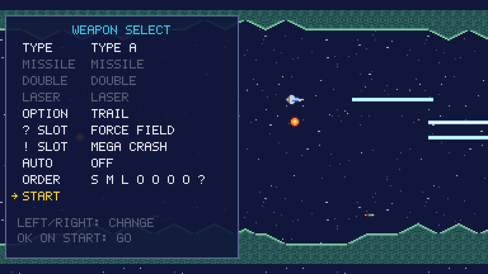

## Capsules

| | | |
|---|---|---|
| 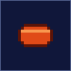 | **POWER CAPSULE** 300 pts | Dropped by capsule carriers, and by a formation you wipe out to the last member. Each one moves the meter's highlight one slot to the right and wraps around at the end. A 16-px magnet pulls it in when you get near. |
|  | **BLUE CAPSULE** 300 pts | Rare. Destroys every enemy on screen the moment you pick it up — and frees any Options an Option Hunter is carrying. |
|  | **1UP** | A spare ship, up to nine. Found in the hidden bonus stages. |
| 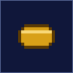 | **BONUS CAPSULE** 1,000 pts | Points, nothing else. The bonus stages are full of them. |
|  | **POINT ITEM** 10 pts each | What a cancelled bullet becomes when a boss dies, a Mega Crash goes off or a black hole swallows it. They fly to whoever earned them. |

## The seven slots

`SPEED UP | MISSILE | DOUBLE | LASER | OPTION | ? | !` — the row along the bottom of the screen.
The highlight moves one slot per capsule; the power-up button equips whatever is lit and puts the
highlight back to the start. A slot you have maxed goes grey, and DOUBLE and LASER are exclusive:
taking one drops the other.

| Slot | What it gives you |
|---|---|
| **SPEED UP** | One more speed level, six in all. The first two capsules of a life almost always go here. |
| **MISSILE** | The missile slot of your chosen weapon type — the only weapon that can reach things on the ground. |
| **DOUBLE** | A second forward shot, angled by your type. |
| **LASER** | Your type's laser, instead of the Double. |
| **OPTION** | One more Option (up to four), a drone that copies every weapon you fire. |
| **?** | Your chosen shield. |
| **!** | Your chosen panic button — by default the **Mega Crash**. |

**Auto Power-Up** takes them for you in an order you can edit on the weapon select, so the remote
never needs a press. It is off by default.

---

## The four weapon types

Every type keeps the same main **SHOT**; the MISSILE, DOUBLE and LASER slots are what change. Pick
a type on the weapon select, or choose **EDIT** and build your own out of any weapon in any slot.

### Type A — the classic

| | | |
|---|---|---|
|  | **SHOT** | The main gun, always on. Two on screen at a time. Everything else is extra. |
|  | **MISSILE** | Drops to the floor and slides along it, following every slope until a wall stops it. The answer to ground turrets. |
|  | **DOUBLE** | Adds a second shot climbing at 45°. |
|  | **LASER** | A piercing beam that grows to 64 px and follows the ship up and down. Hurts each enemy at most every sixth tick, so it is not simply "more damage" — it is damage through a *line* of enemies. |

### Type B — the demolition set

| | | |
|---|---|---|
| 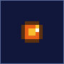  | **SPREAD BOMB** | Lobbed forward and down on an arc. The bomb itself does nothing — where it lands it becomes a **blast** that sticks to the ground, burns for 12 ticks and hits everything in reach twice. |
|  | **TAIL GUN** | A forward shot plus one straight out the back. The only clean answer to zone E's rear attackers. |
| 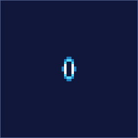 | **RIPPLE LASER** | A ring that grows as it flies. The **ring** is the hitbox, not the middle: it sweeps a wider and wider line the further it gets, and small things it has already swallowed stop taking hits. |

### Type C — the angles

| | | |
|---|---|---|
|  | **2-WAY MISSILE** | A pair thrown up and down at once. Ceiling and floor in one volley; the next pair waits until both are gone. |
|  | **VERTICAL** | A forward shot plus one straight up, with a tall hitbox. |
|  | **CYCLONE LASER** | An 80-px swirling beam, thick and piercing. The heaviest single-target weapon in the meter arsenal. |

### Type D — the precision set

| | | |
|---|---|---|
|  | **PHOTON TORPEDO** | Falls to the ground, slides fast — and **flies on through anything it destroys**. It is stopped by a survivor, by armour and by boss parts. |
|  | **FREE WAY** | A forward shot plus one in the last direction you were *holding*. Let go of the stick and it keeps that angle: you aim by flying. |
|  | **TWIN LASER** | Two short beams 8 px apart that follow your row. Four beams on screen — two pairs — and every Option fires its own. |

### EXTRA EDIT

Seven more weapons unlocked by a secret code on the title screen
([`extra-modes-and-replays.md`](extra-modes-and-replays.md)): **CONTROL MISSILE** (steerable),
**UPPER MISSILE** (the ceiling's), **SMALL SPREAD**, **HAWK WIND**, **2-WAY BACK**, **BACK
DOUBLE** and the **SPREAD GUN**, which can be equipped twice for a wider fan. They can be put in
any EDIT slot alongside the others.

---

## Options

| | |
|---|---|
| 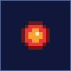 | Up to **four** Options, one per OPTION capsule. Each is an indestructible drone that fires whatever you fire, with its own caps — four Options is roughly five ships' worth of gunfire. Nothing can destroy them. One thing can **steal** them: the [OPTION HUNTER](bestiary.md#hunters-and-other-trouble). |
| 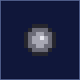 | An Option in a hunter's grip. Kill the hunter, or set off a Mega Crash, and they drift free as items you can collect again. |

How they fly is a choice on the weapon select:

| Type | Behaviour |
|---|---|
| **TRAIL** | The classic: each Option repeats the path you flew, twelve records behind the one in front. They bunch up when you idle and string out when you move. |
| **SNAKE** | A pulled chain: each link hangs 16 px from the one ahead and only ever moves when it is pulled. Stop, and the shape you made stays exactly where it is. |
| **FORMATION** | Fixed offsets: a tight `>` behind you, opening into a wide `V` when you spread them. |
| **ROTATE** | A ring orbiting your ship, one turn every 1.4 seconds, widening from 20 px to 40 px when you extend them. |

**Spread and retract** (FORMATION and ROTATE): tap **Special** — Channel-up on the remote, **V**
on a keyboard, **Y** on a pad — to toggle, or simply *hold* the power-up button for a quarter of a
second. A short tap of power-up still equips a slot and never moves them.

---

## The `?` slot — five shields

None of them protect you from the rock. Terrain is always lethal.

| | | |
|---|---|---|
| 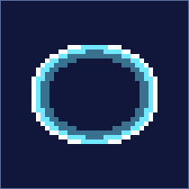 | **FORCE FIELD** | A bubble around the whole ship that takes **five** hits from bullets, lasers or rammed enemies. It visibly wears down, and gives you a few invulnerable frames per hit. |
| 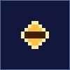 | **SHIELD** | Two pods hanging ahead of you, 14 hits each, wearing independently. They stop what touches *them* — a bullet is used up, a body costs a hit and flies on. |
|  | **FREE SHIELD** | The same pods, but a pair appears centred on the direction you are last holding, up to four pods in all. Take another and it replaces the most worn pair. |
|  | **ROTATE SHIELD** | Two pods orbiting 16 px out, turning all the time. Nowhere is safe for long, and nowhere is unguarded for long either. |
| 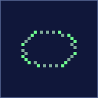 | **REDUCE** | No shield at all — your ship's hitbox **shrinks** in two steps, shown by a dotted shimmer. Two hits' worth. It is the choice for players who would rather not be hit than survive being hit. |

## The `!` slot — five panic buttons

| Choice | What it does |
|---|---|
| **MEGA CRASH** | The default. Cancels every enemy bullet on screen — each one becomes a point item — and destroys every enemy that is not immune. Also frees stolen Options. |
| **NORMAL** | Puts your Double or Laser back to the plain shot. Deliberately: a weak shot is easier to see past. |
| **SPEED DOWN** | One speed level *off*. Six is too fast for a lot of corridors. |
| **LIFE OPTION** | Turns your spare ships into Options. All the power now, nothing in reserve. |
| **FULL BARRIER** | Your `?` shield back to full strength, whichever one it is. |

---

# MANTA — Direct mode

No meter, no cursor, no waiting. Six colours of item drift out of the carriers, and each one does
its thing the moment you touch it.

| | | |
|---|---|---|
|  | **RED** | One level on your **main** shot family, up to nine. At the top it is worth points. |
| 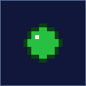 | **GREEN** | One level on your **sub** weapon, up to nine. |
|  | **BLUE** | The **Arm**: grants it, repairs it, and at four and nine blue items upgrades its tier. Never wasted. |
|  | **ORANGE** | A spare ship, up to nine. |
| 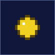 | **YELLOW** | A smart bomb: every bullet on screen becomes points, every enemy that is not immune dies. With **BLACK HOLE** switched on it stocks a bomb instead. |
|  | **OCTAGON** | Switches your main shot to the *other* family, keeping the level you had. |

Items drift, bounce off the top and bottom of the playfield, blink when they are about to expire
and are gone after ten seconds — and they pass right by if you are not paying attention. Dying
costs you levels, which is Direct mode's whole tension: the MANTA is always either climbing or
falling.

## The two main families

| | | |
|---|---|---|
|  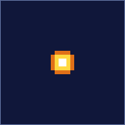 | **BEAM > DISC** levels 1–9 | Starts as a single bolt, becomes a wide bolt, then a pair, then small discs — one, two, a three-way fan — and finally one enormous disc that hits for twelve. Breadth first, then weight. |
| 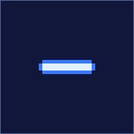 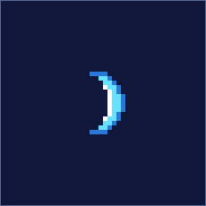 | **LASER > WAVE** levels 1–9 | Bolt, then laser, wide laser, long laser, a round piercing laser, and then the **wave**: a piercing sheet that grows through four sizes. The family for shooting *through* things. |

## The sub weapon

| | |
|---|---|
|     | **SUB WEAPON**, levels 1–9. It begins as one arcing bomb, becomes two, then four in a cross, then sub-lasers in four directions, then eight of them, and ends as four big sub-discs. Nine green items and nothing can approach you from any side. |

## The Arm

| | |
|---|---|
| 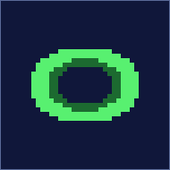 | Direct mode's shield, and the only one in the game that **absorbs terrain**. Blue items grow it through three tiers — **ARM** (3 hits), **SUPER ARM** (4), **HYPER ARM** (5) — and each further blue repairs it. Lose it and the next blue starts again at green. Its pips are on the HUD. |

## The black-hole bomb

| | |
|---|---|
|  | With **BLACK HOLE** switched on in the options, yellow items stock bombs (up to three; every stage starts you with one) instead of going off at once. Press **Special** and a vortex opens ahead of the ship: for about a second and a half it drags enemy bullets in and swallows them for points, and pulls enemies towards it — then it discharges, and lightning destroys everything still in reach. It is the MANTA's signature move, and the only one in the game. |

---

*Pictures generated by `pnpm docs:images` and `pnpm docs:screens` — the sprites and screens are
the game's own.*
