# Bestiary — the Iron Tide

> THEN THE IRON TIDE ROSE FROM THE DEEP: FORTRESS-SHIPS THAT SWALLOW SUNS, FLEETS THAT SING AS
> THEY BURN. ONE BY ONE THE BEACONS WENT DARK.

Everything that flies at you, in the order a run meets it. Every picture on this page is the
enemy's own art, drawn straight from the game's sprite sources by `pnpm docs:images` — the bosses
are assembled part by part from the same data the game builds them from, so a portrait shows
exactly what arrives on screen, weak point and all.

Numbers are the shipped values on **NORMAL**: hit points, and the score a kill pays. Difficulty,
[rank](../dev/difficulty-and-rank.md) and the loop change how fast a thing shoots and how quick
its bullets are — never how much it takes to kill.

| | |
|---|---|
| Your ships and everything you shoot back with | [`arsenal.md`](arsenal.md) |
| What a first-time player should look at | [`preview-build.md`](preview-build.md) |
| The controls | [`controls.md`](controls.md) |

**Contents:** [A](#zone-a--azure-verge) · [B](#zone-b--brine-nebula) ·
[C](#zone-c--dune-expanse) · [D](#zone-d--magma-deep) · [E](#zone-e--tempest-ridge) ·
[F](#zone-f--cell-vault) · [G](#zone-g--prism-labyrinth) · [H](#zone-h--iron-citadel) ·
[I](#zone-i--abyssal-throne) · [Hunters and other trouble](#hunters-and-other-trouble) ·
[Bosses you only meet in EXTRA](#bosses-you-only-meet-in-extra)

---

## Zone A — AZURE VERGE

> THE RIM OF THE HOME SYSTEM. FIRST CONTACT WITH THE SWARM.

The quiet edge of home, and the first place the Tide touched. Nothing here is built for a war —
these are survey drones and mining tenders with guns bolted on, thrown at you because they were
nearest.

| | Enemy | What it does |
|---|---|---|
|  | **SKEET** 1 HP · 100 pts | A hollow scouting pod that rides a slow sine wave across the screen at 1.1 px a tick. They come in loose strings; the chained version swims a wider, faster wave, each pod half a beat behind the one in front. Harmless on its own — deadly as scenery you stop watching. |
| 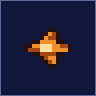 | **VANE** 1 HP · 100 pts | A bladed flier that enters in a fan, loops once and leaves. It never shoots. It does not have to: a fan of six crossing the playfield at 1.6 px a tick turns the middle of the screen into a place you cannot be. |
|  | **TENDER** 3 HP · 200 pts | The Tide's supply drone, crawling forward at 0.7 px a tick with a stolen power capsule in its belly. Kill it and the capsule is yours; let it leave and that capsule is gone. The whole power meter runs on these, and a zone only has so many. |
| 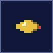 | **LANCER** 1 HP · 150 pts | A one-use ramming spike. It drifts in from the right, stops, points itself at you for 24 ticks — the wind-up is the tell — then throws itself along that line at 2 px a tick and never turns again. Move after it commits. |
|  | **PICKET** 3 HP · 300 pts | A gun emplacement bolted to the floor or hanging from the ceiling, firing an aimed shot every 110 ticks. Picket lines are placed so the terrain does half their work: the safe lane is usually the one that looks too tight. |
| 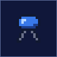 | **STRIDER** 2 HP · 200 pts | A walker that grips the ground and follows every slope at 0.6 px a tick, shooting as it goes. It cannot be outrun — the ground brings it to you. |
|  | **BURROW** 8 HP · 500 pts | A buried hatch that opens every 90 ticks and lets out a mite, up to four at a time. Eight hit points is a lot for this early in the game, and it keeps producing until it is gone: kill the hatch, not the swarm. |
|  | **BURROW MITE** 1 HP · 50 pts | What comes out of a BURROW. It climbs away from the hatch, turns, and dives at you at 1.75 px a tick after a short wind-up. One shot kills it. There are always more. |
|  | **GYRE** 4 HP · 400 pts | A rotating ring-gun that circles the playfield at 1.4 px a tick and lets go of a full ring of bullets every 150 ticks. Rings are slow (1 px a tick) and generous — you fly through the gaps, you do not outrun them. |

### HALCYON BULWARK · HB-01

**30,000 pts.** The first fortress the Tide could spare. Four shield plates stand in a wall in
front of its core, and the two emitters on its wing tips paint a warning line across the screen
before the beam arrives.

Shoot the plates down — the core cannot be hurt while a single one stands. With two gone it starts
aiming three-way spreads at you as well, and at the end the two lanes overlap: there is always a
gap, and it is always where the lines are not.

---

## Zone B — BRINE NEBULA

> A DRIFTING SEA OF GAS AND BUBBLES. WATCH FOR WHAT HIDES INSIDE.

A nebula that behaves like an ocean. Everything here floats, splits, or is waiting inside
something else.

| | Enemy | What it does |
|---|---|---|
|  | **FROTH** 3 HP · 200 pts | A gas sac that bobs forward on a long, lazy wave. Kill it and it becomes two beads flying apart at 1.1 px a tick — killing it at the wrong moment is how you get hit. |
|  | **FROTH BEAD** 1 HP · 50 pts | What FROTH leaves behind. Smaller, quicker, and it does not split again. |
| 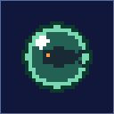 | **BROOD BUBBLE** 4 HP · 300 pts | A bubble with something alive in it. It drifts slower than the froth and scatters its single passenger on a delay, so the split lands after you have already moved on. |
| 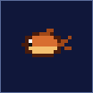 | **GILL DART** 1 HP · 150 pts | The nebula's rammer: a finned dart that lines up for 18 ticks and then runs its line at 1.75 px a tick. |
|  | **REEF JELLY** 4 HP · 400 pts | A drifting bell that swims a wide sine and fires scripted bullet patterns between 30-tick rests. It is the zone's first real bullet source — learn its rhythm and the rest of the nebula is easy. |
|  | **URCHIN** 3 HP · 300 pts | A spined turret rooted to the reef floor or ceiling, aiming at you every 140 ticks. |
|  | **MAW ROCKET** 1 HP · 100 pts | A homing torpedo, fired in pairs by the zone's boss. It drifts for 20 ticks, then turns after you for a full second before it gives up and flies straight. Shoot them, or make them chase you into a wall. |

### SPUME HERALD · SH-02

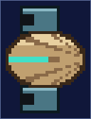

**4,000 pts.** A ridged shell with two launch tubes that glides in from the right **with no
WARNING and without stopping the scroll**. The zone keeps moving while you fight it. It is here to
teach you that not every big thing gets a siren.

### GALVANIC MAW · GM-02

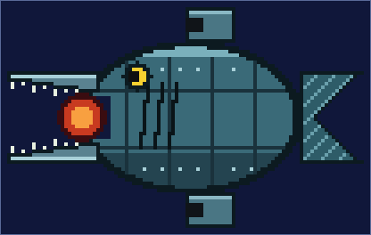

**35,000 pts.** A mechanical fish the size of the playfield. Hull and jaws are armour — shots
clink off them and nothing happens. The only way in is the **mouth**, and the mouth is only open
when it is about to bite. Sit under the jaw, wait for it to yawn, and empty everything you have
into the throat before it shuts.

---

## Zone C — DUNE EXPANSE

> SAND WORLDS UNDER TWIN SUNS. THE GROUND ITSELF MOVES.

A desert route the Tide colonised from below. Half of this zone is the floor.

| | Enemy | What it does |
|---|---|---|
| 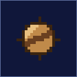 | **DUNE WORM** 2 HP · 100 pts | It is not on screen until you are close. Fly within range and it erupts from the sand, arcs up at 3.3 px a tick and falls back under gravity. The dunes are full of them, and nothing warns you. |
| 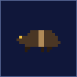 | **HUSK CRAWLER** 3 HP · 250 pts | A shelled walker that crawls the dunes for 80 ticks, plants itself for 50, fires a spread, and starts walking again. Hit it while it is stopped. |
| 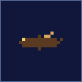 | **SAND SKIMMER** 1 HP · 100 pts | A paper-thin glider that comes in on a baked curve — fast, fragile, and always in a formation whose shape is the actual attack. |
| 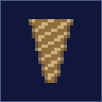 | **DUST DEVIL** 6 HP · 500 pts | A standing column of sand that walks slowly against the scroll and fires patterned bursts with 70-tick pauses. It soaks up fire; do not fight it in the open unless you have to. |
| 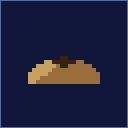 | **SAND GEYSER** 10 HP · 700 pts | A vent in the dunes that lobs three clods at a time in a spreading arc, every 110 ticks. Ten hit points means it is usually cheaper to fly past it. |
|  | **SAND CLOD** 1 HP · 30 pts | What a geyser throws — and what the ceiling drops the moment you fly under it. One hit point, worth almost nothing, kills you exactly as dead. |
| 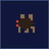 | **WIDOW DRONE** 2 HP · 150 pts | The SANDGRAVE WIDOW's brood, sent ahead of her. Slower to commit than most rammers, and tougher. |

### SANDGRAVE WIDOW · SW-03

**35,000 pts.** A spider the size of a gunship, hung over the dunes on lines you cannot see until
she spins them. Break the **fangs** first — while they stand, everything else on her is armour.
Then it becomes a dance around her drones and the silk lines she lays across the playfield. She
never spins a second line before the first has faded, so there is always one clean side.

---

## Zone D — MAGMA DEEP

> ERUPTING PEAKS, THEN THE CAVES BENEATH THEM.

The zone dives: you start over the volcano field, and end inside a brick maze with lava under the
floor. The terrain here can kill you on its own, and often does it first.

| | Enemy | What it does |
|---|---|---|
|  | **EMBER WISP** 1 HP · 100 pts | Burning gas in a loose chain, riding a wave across the caldera. Popcorn — but popcorn in front of a wall. |
| 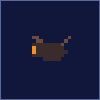 | **CINDER BAT** 1 HP · 150 pts | A looping flier that comes off the peaks in fans at 1.5 px a tick. |
| 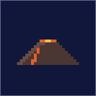 | **MAGMA CONE** 12 HP · 800 pts | A live volcano. Every 100 ticks it throws three bombs on spreading arcs that fall back through the whole playfield. Twelve hit points; the eruption keeps coming until the last one lands. |
|  | **MAGMA BOMB** 1 HP · 30 pts | A thrown blob of lava. Shootable, barely worth points, and there are always three in the air. |
|  | **CINDER ROCK** 2 HP · 100 pts | A boulder in the cave roof that lets go when you come within 60 px and falls fast. In the maze this is the trap: the gap you are aiming for is the one with the rock over it. |
|  | **SLAG CRAWLER** 3 HP · 250 pts | A walker of fused rock, slow even for a walker, that stops to fire a spread every 90 ticks of walking. |
|  | **BASALT TURRET** 4 HP · 300 pts | The cave's gun: four hit points, an aimed shot every 150 ticks, and a habit of being placed exactly where the corridor narrows. |

### CINDER BASTION · CB-04

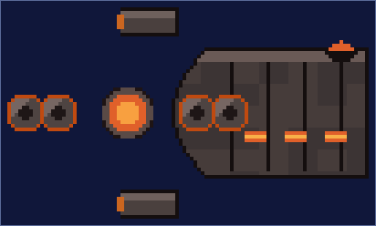

**35,000 pts.** A battleship that fills the shaft it sits in. Its core is exposed — but two
armoured arms turn around it, and lane lasers sweep the room. Fire when no arm covers the core;
hitting the arms does nothing but noise.

---

## Zone E — TEMPEST RIDGE

> STORM CLOUDS OVER JAGGED RIDGES. ENEMIES STRIKE FROM BEHIND.

The first zone that attacks the half of the screen you have been ignoring.

| | Enemy | What it does |
|---|---|---|
|  | **HAIL DRIFTER** 1 HP · 100 pts | Frozen shot in a tight chain, on a short, quick wave. |
|  | **GALE KITE** 1 HP · 150 pts | A wind-borne flier that loops through the ridge line in fans at 1.6 px a tick. |
| 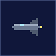 | **SQUALL JUMPER** 2 HP · 200 pts | It enters from the **left**, behind you. It overtakes you, holds on the right for 20 ticks, fires, and leaves the way it came. Everything you have learned about facing right is wrong for two seconds. |
|  | **CRAG TURRET** 3 HP · 300 pts | A ridge gun, aiming every 130 ticks — the busiest turret of the middle zones. |
| 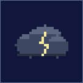 | **THUNDERHEAD** 5 HP · 500 pts | A storm cell that drifts against the scroll and fires patterned bursts with 40-tick rests. It is slow, it is wide, and it is in the way. |
|  | **STEED FOAL** 1 HP · 100 pts | A little homing seahorse the boss sends out in litters. It turns after you for over a second. |

### SQUALL STEED · SS-05

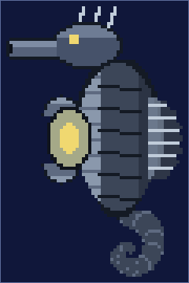

**35,000 pts.** A vast seahorse of plate and cable that bobs on the storm. Body, head and lids are
armour. The **chest** opens to let the foals out — that is the only moment it can be hurt, and
the only moment the screen is full of little homing things.

---

## Zone F — CELL VAULT

> LIVING WALLS THAT GROW BACK. SOMETHING IN THERE IS HUNGRY.

The Tide's nursery. The walls are tissue: you can shoot through them, and they heal.

| | Enemy | What it does |
|---|---|---|
|  | **LYMPH MOTE** 1 HP · 100 pts | Single cells drifting down the vein in chains. |
|  | **CHASER CELL** 2 HP · 200 pts | It enters, finds you, and follows — turning to track you for over two seconds before it gives up and scatters. Two of them from opposite sides is a real problem. |
|  | **MITOSIS CELL** 6 HP · 600 pts | Six hit points, and when it dies it becomes two more, thrown wide apart. Kill it where you have room. |
| 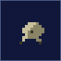 | **VAULT CLAW** 5 HP · 400 pts | An eight-link tentacle rooted to the wall. It extends 72 px looking for you, and if your ship is inside its grab radius it **takes hold and pulls** — into the wall, usually. Shoot the root, not the arm. |
| 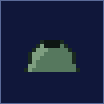 | **POLYP TURRET** 4 HP · 300 pts | A growth in the tissue that aims every 170 ticks. |
| 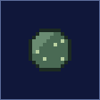 | **SPORE SAC** 4 HP · 500 pts | It flies to a fixed post high or low in the room, anchors there for 320 ticks laying down patterns, and lifts away. Two of them, one high one low, is the zone's signature crossfire. |

### MANTLE REGENT · MR-06

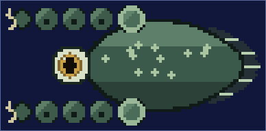

**40,000 pts.** The thing the vault was grown around. Its mantle and its tentacles are armour, and
the tentacles curl in front of the **eye** whenever it feels threatened. Wait for them to open,
hit the eye, and get out before they close on you.

---

## Zone G — PRISM LABYRINTH

> CRYSTAL CORRIDORS AND A RUSH OF CUBES THAT BUILD WALLS.

Everything here is glass, including the walls that appear in front of you.

| | Enemy | What it does |
|---|---|---|
|  | **GLINT MOTE** 1 HP · 100 pts | Crystal dust in a chain, riding a short wave. |
|  | **PRISM CUBE** 1 HP · 60 pts | One cube is nothing. They arrive in a rush, stop short of the left edge and **stack into a wall** — one hit point each, and you have a few seconds to cut a door before the wall is finished. |
|  | **FACET TURRET** 4 HP · 300 pts | A crystal gun that aims every 180 ticks, grown into corridor walls you cannot shoot through. |
|  | **HALO CRYSTAL** 6 HP · 600 pts | An orbiting crystal that circles the room and lets go of an eight-way ring every 120 ticks. |
|  | **PRISM LENS** 5 HP · 500 pts | It takes a post at the top or bottom of the corridor, holds for 360 ticks firing patterns, then lifts away. |
| 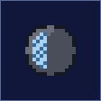 | **GEODE** 8 HP · 700 pts | A slow armoured nodule. Eight hit points, and it breaks into **three** shards scattered wide. |
|  | **GEODE SHARD** 1 HP · 50 pts | What comes out of a GEODE — quick, small, and going somewhere you are. |

### FACET MONARCH · FM-07

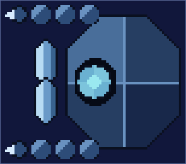

**40,000 pts.** A crown of crystal segments around a single core, growing new facets as you break
the old ones. The core is the only thing that counts; the facets exist to make you waste time.

---

## Zone H — IRON CITADEL

> THE ENEMY FORTRESS. ITS MASTER WAITS INSIDE.

One of the two ways a run ends. The Citadel is a factory, and every part of it is a gun.

| | Enemy | What it does |
|---|---|---|
| 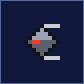 | **BOLT DRONE** 1 HP · 100 pts | Mass-produced chaff that comes down the piston hall in chains. |
|  | **HATCH BAY** 6 HP · 500 pts | A production bay in the floor or ceiling that puts out a mite every 100 ticks, three at a time. Six hit points; it will outlast your patience. |
| 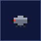 | **HATCH MITE** 1 HP · 60 pts | What the bays make. They peel away from the hatch, turn, and dive. |
|  | **LASER EMITTER** 6 HP · 600 pts | The Citadel's lane weapon: a 60-tick telegraph line across the room, then a 6-px beam for 36 ticks, over and over every 200 ticks. The line is the whole warning you get, and it is enough. |
| 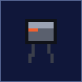 | **SENTINEL WALKER** 4 HP · 400 pts | A heavy walker patrolling the fortress floor, stopping every 100 ticks to fire a spread. |
|  | **RAIL TURRET** 4 HP · 300 pts | A hardened rail gun set into the walls, aiming every 180 ticks. |
|  | **SOVEREIGN DRONE** 2 HP · 150 pts | The Sovereign's personal escort: a bolt drone rebuilt to chase, tracking you for two seconds before it scatters. |

### The parade — BULWARK ECHO · MAW ECHO · BASTION ECHO · REGENT ECHO

| | | | |
|---|---|---|---|
| 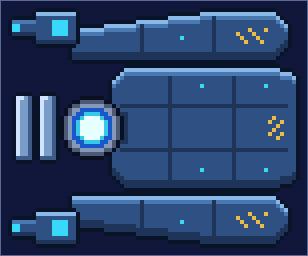 | 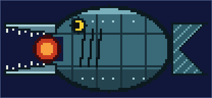 | 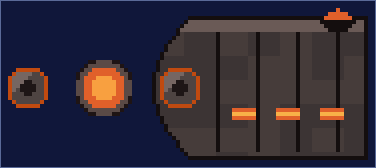 | 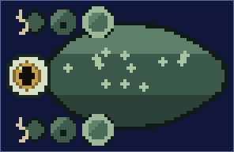 |
| **BULWARK ECHO** HB-E1 | **MAW ECHO** GM-E2 | **BASTION ECHO** CB-E3 | **REGENT ECHO** MR-E4 |

**8,000 pts each.** Before the Sovereign will see you, the Citadel sends out copies of the bosses
you have already killed — smaller, faster, one after another with barely a breath between them.
They fight the way the originals did. You are being shown that the Tide can simply make more.

### IRON SOVEREIGN · IS-08

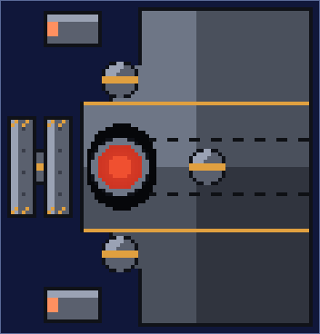

**60,000 pts.** The heart of the fortress: a slab of hull with a red core, shielded by plates,
flanked by pods and emitters, and surrounded by its own hatches. Kill it and the Citadel falls —
one of the game's two endings, and the only one where the fortress burns behind you.

---

## Zone I — ABYSSAL THRONE

> THE FLAGSHIP OF THE DEEP. STRIKE AT ITS HEART.

The other ending. There is no fortress here — only water, and the thing the fortress was built to
serve.

| | Enemy | What it does |
|---|---|---|
|  | **LUMEN MOTE** 1 HP · 100 pts | Cold light in a chain, drifting up out of the trench. |
| 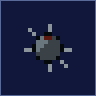 | **DEPTH MINE** 3 HP · 300 pts | It hangs still until you come within 60 px, then arms — 40 ticks of fuse, then an eight-way ring in every direction at once. Shoot it early or leave it alone entirely. |
| 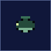 | **TRENCH EEL** 2 HP · 150 pts | Buried in the trench wall until you are near, then it bursts out in an arc and falls back. The abyss's answer to the dune worm. |
| 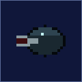 | **GULPER** 6 HP · 600 pts | A deep-water mouth that takes a post at the top or bottom of the trench, holds for 340 ticks firing patterns, and swims away. |
| 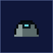 | **ABYSS TURRET** 4 HP · 300 pts | The depth mines' gun cover, aiming every 180 ticks from floor and ceiling. |
| 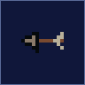 | **ARK HOOK** 2 HP · 200 pts | A boarding hook fired from the ARK, turning after you for over a second before it commits. |
|  | **KING SPAWN** 1 HP · 100 pts | What the King makes while you fight it. One hit point each, and it never stops making them. |

### ABYSS ARK · AA-09

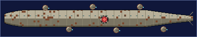

**50,000 pts.** Not a boss you meet — a boss you **board**. The ARK is a moving fortress the
camera follows, with turrets along its hull and a heart deep inside it. You have **90 seconds**.
Fail to break the heart in time and the ARK turns, dives, and takes its master with it: the run
ends on THE FLAGSHIP SLIPS AWAY, and THE HOLLOW KING never wakes.

### THE HOLLOW KING · HK-10

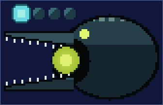

**60,000 pts.** Inside the ARK, in the dark, with a lure hanging in front of its own jaws. It is
the last thing in the game and it fights like it: jaws that close on the whole playfield, a lure
that is not the weak point, and spawn after spawn while you look for the one that is.

---

## Hunters and other trouble

| | | |
|---|---|---|
| 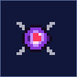 | **OPTION HUNTER** 1 HP · 1,000 pts | It only ever appears if you have **Options**, and you hear it before you see it. It lines up, charges, and takes your Options with it — you watch them fly away behind its tail. One hit point: kill it on the approach and you keep everything. Kill it after the steal and it drops them as drifting items you can collect again; a **Mega Crash** frees them too. Three of them hunt differently: one from behind, one from the front at speed, one diving. |
|  | **BLUE CARRIER** 2 HP · 500 pts | A tender carrying the rare **blue capsule**, which destroys every enemy on screen the moment you pick it up. |
|  | **BONUS CAPSULE** 1,000 pts | Found in the hidden bonus stages behind zones B and G, along with 1UPs and brick barriers with nothing behind them but points. |

### Hazards, not enemies

Some things in a zone are terrain with intent. They are spawned like enemies, they can be shot,
and several of them are the reason a section is hard.

| | | |
|---|---|---|
| 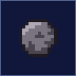 | **FALLING ROCK** | Hangs in the ceiling until you come close, then drops. |
| 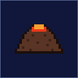 | **VOLCANO** | Lobs bombs on arcs, over and over, for as long as it lives. |
|   | **BUBBLE** | Splits when killed — and the halves split your attention. |
| 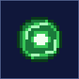 | **SUCTION POD** | Opens a pull field that drags your ship towards it. Fly across the pull, never into it. |
|  | **TENTACLE** | Reaches out, grabs, and pulls you into the wall it is growing from. |
|   | **RUSH CUBE** | Charges in and stacks into a wall with the others. |
|  | **LAVA STONE** | Thrown up out of the lava river and dropped back through your lane. |
| 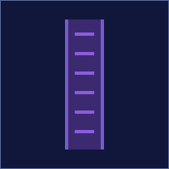 | **DIM PYLON** | A tall marker post in the HIGH-SPEED DIMENSION, where the floor is a Mode-7 plane and everything comes at you at once. |

---

## Bosses you only meet in EXTRA

The title screen's **EXTRA** menu ([`extra-modes-and-replays.md`](extra-modes-and-replays.md))
opens the boss rush and the practice ranges, where the fights that never got a zone live.

### Captains

Mid-bosses: small, fast, and gone in under a minute. **3,000 pts each.**

| | | | |
|---|---|---|---|
| 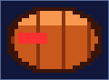 | 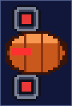 | 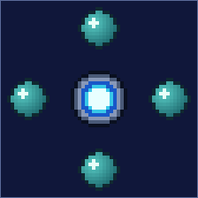 | 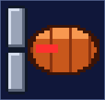 |
| **SURGE RAMMER** CP-01 Charges the lane you are in. | **BROOD LAUNCHER** CP-02 Fills the room with children. | **ORBIT WARDEN** CP-03 Circles and rings you. | **TIDE CRAB** CP-04 Walks the floor and pinches. |

### The raid

| | |
|---|---|
| 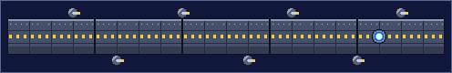 | **IRON LEVIATHAN** RL-01 — **40,000 pts.** A thirteen-part hull the camera follows while you fight along its length. |
|  | **LEVIATHAN HEART** LH-02 — **20,000 pts.** What is inside it, once you have opened it. |

### The twins

| | |
|---|---|
|   | **EMBER AND FROST TWINS** TE-01 / TF-02 — **15,000 pts each.** Two bosses at once, one hot, one cold, sharing a health bar's worth of your attention and none of their own. |

### The three that hunt you

| | |
|---|---|
|  | **GRASPING BLOOM** GB-11 — **24,000 pts.** A flower of suction fields. It does not shoot you; it pulls you into things that do. |
|  | **IRON TALON** IT-12 — **6,000 pts.** A grabber. If it closes on you, you are not flying any more. |
|  | **SHADOW STRIDER** SS-13 — **no points.** It cannot be killed. It walks, and you leave. |

### TRIAL WARDEN · TW-00

| | |
|---|---|
|  | **20,000 pts.** The BOSS RANGE's practice target — nine parts, every weak-point rule in the game, and the first thing in the project that ever put a `WARNING!!` on screen. |

---

*Pictures generated by `pnpm docs:images` (sprites and boss part trees) and `pnpm docs:screens`
(real captures of the running game). Nothing on this page is drawn by hand.*
