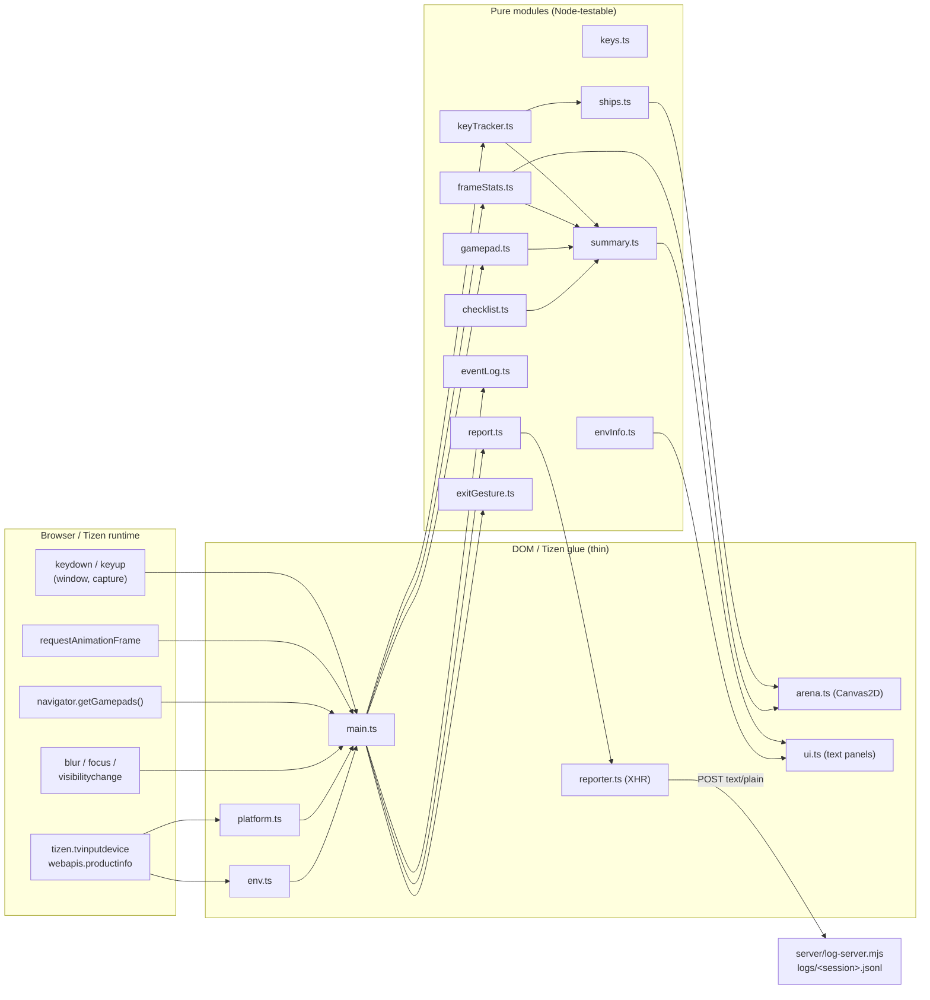

# Input probe — developer guide

`tools/input-probe/` is a throw-away diagnostic Tizen web app (`.wgt`) that measures how the Samsung Smart Monitor
M7 (M70A, Tizen 5.5 / Chromium 69) and its Smart Remote, gamepads and display actually behave. Its findings go into
`shmup_tech.md` §2.7 and decide the remote control scheme in `shmup_feat.md` §4 (and therefore how
`@shmup/input-web` debounces keys).

- Spec: [`input_probe_spec.md`](../../input_probe_spec.md)
- Operator's README (build / package / deploy commands for Windows and Linux): [`tools/input-probe/README.md`](../../tools/input-probe/README.md)
- Tester guide (screen, protocol, reading the verdicts): [`docs/client/input-probe.md`](../client/input-probe.md)

It is a **standalone npm project** — its own `package.json` and `package-lock.json`, **not** a member of the pnpm
workspace (which only includes `packages/*` and `apps/*`), not linted by the root ESLint config, and not part of
`pnpm test` / Turborepo. Always run `npm` from `tools/input-probe/`. It shares no code with the game packages on
purpose: it must keep working unchanged while the engine evolves.

## Quick reference

```sh
cd tools/input-probe
npm install
npm run dev            # Vite dev server, http://localhost:5173 (keyboard arrows / Enter / R)
npm run verify         # typecheck + test + build + check:compat — run before every commit
npm run package        # needs TIZEN_PROFILE + Tizen CLI (Windows desktop)
npm run deploy         # needs TV_IP (+ TIZEN_PROFILE if it must package first)
npm run log-server     # optional JSONL receiver on :8787
```

| Script | Does |
|---|---|
| `dev` / `build` / `preview` | Vite dev server / production build into `dist/` / serve `dist/` |
| `typecheck` | `tsc --noEmit` for `tsconfig.json` (app: ES2018 + DOM lib), `tsconfig.node.json` (Vite/Vitest configs), `tsconfig.test.json` (tests) |
| `test` / `test:watch` | Vitest (Node environment, `test/**/*.test.ts`) |
| `check:compat` | `scripts/check-compat.mjs dist` — syntax + widget-file gate for Chromium 69 |
| `verify` | all of the above in order |
| `icon` | regenerate `public/icon.png` (`scripts/make-icon.mjs`) |
| `package` / `deploy` | `scripts/package.mjs` / `scripts/deploy.mjs` (Tizen CLI wrappers, Windows-first) |
| `log-server` | `server/log-server.mjs` |

Toolchain: TypeScript 7 (the probe has no ESLint, so it is not bound by the workspace's TypeScript 6 pin), Vite 8
(Rolldown), Vitest 5, acorn (compat check only). No runtime dependencies. **Node:** Vite 8 — and therefore
`build`, `package`, `deploy`, `log-server` — runs on Node `^20.19 || >=22.12` (the `engines` field says `>=20.19`),
but Vitest 5 needs `^22.12 || ^24 || >=26`, so `npm test` / `npm run verify` need Node 22.12+ (24 recommended,
matching the repo's `.nvmrc`).

## Architecture

The design rule: **every decision lives in a pure, DOM-free module** that takes plain values (key code, `repeat`
flag, timestamp, frame delta, gamepad snapshot) and returns plain values. The DOM / Tizen / canvas glue only reads
browser state, forwards it, and writes results back. This makes all verdict logic unit-testable in Node and keeps
the glue small enough to be covered by one end-to-end test.



### Per-event and per-frame flow (`main.ts`)

**Key event** (`onKey`, capture listener on `window`):

1. `chooseEventTime(ev.timeStamp, performance.now())` → exact event time + dispatch delay (→ `RunningStats`).
2. `shouldPreventDefault(code, modifiers, tizenPresent)` → maybe `ev.preventDefault()`.
3. `KeyTracker.keyDown(code, repeat, t)` → `'press' | 'repeat' | 'repeat-noflag' | 'bounce'`, or
   `KeyTracker.keyUp(code, t)` → raw hold ms.
4. The event is formatted (`formatEvent`) into the on-screen `LineLog`, `console.log`ged (`[probe] …`, visible in
   the remote inspector) and queued for the report (`ReportQueue.push`).
5. Every keydown without the `repeat` flag arms the 4-frame flash; a `'press'` of Back feeds the triple-Back
   `MultiPressDetector` (→ `tizen.application…exit()`), a `'press'` of Play/Pause or `R` resets the statistics.

**Frame** (`frame`, rAF):

1. `FrameStats.push(now - lastFrame)`.
2. `KeyTracker.tick(now)` — finalizes releases / verdicts whose windows have passed.
3. Gamepad poll (`GamepadMonitor.update`) — every frame once a pad was seen, otherwise every 30 frames.
4. `stepLanes(lanes, tracker, now)` → `Arena.draw(frameState)`.
5. Every 100 ms: `updateUI` (snapshot → checklist → verdicts → panel text; `ProbeUI.set` skips unchanged text).
6. Every 3 s when reporting is enabled: `Reporter.send(…)`.

Steps 1–4 are allocation-free (typed-array rings, reused state objects, a reused `frameState`), because the probe
is also a performance probe. Snapshots, panel strings and report payloads allocate, but only at 10 Hz / every 3 s.

**Lifecycle:** `blur` → `KeyTracker.releaseAll` (keyups may never arrive) + log; `focus`, `visibilitychange`,
`gamepadconnected` / `gamepaddisconnected` → log; hidden → visible marks the *Left (Home) and returned* checklist
item; `resize` → `ProbeUI.fit`. The environment is collected 250 ms after start (WebGL / AudioContext probes are
slow-ish) and once more on `load` if `webapis.js` arrived late.

### Modules

Pure modules (no DOM access; imported by the tests directly):

| Module | Responsibility | Main exports |
|---|---|---|
| `keys.ts` | Key codes, code → name mapping, which keys to register, `preventDefault` policy | `KeyCode`, `ARROW_CODES`, `MANDATORY_CODES`, `STATIC_KEY_NAMES`, `KeyNames`, `isArrow`, `isExtraKey`, `selectKeysToRegister`, `shouldPreventDefault`, `SupportedKey`, `RegisterResult` |
| `keyTracker.ts` | Raw / logical / debounced / naive key state; classification of every keydown; all key verdicts and hold/repeat statistics | `KeyTracker`, `DEFAULT_KEY_TRACKER_OPTIONS`, `KeyStats`, `KeyDownKind`, `RepeatStyle`, `DiagonalVerdict`, `ChordVerdict`, `SeenKey`, `dominantRepeatStyle` |
| `ships.ts` | The three lanes (A raw, B debounced, C naive), trails and 240-frame movement timelines | `Ship`, `Lanes`, `createLanes`, `stepLanes`, `wrap`, `axis`, `SHIP_SPEED_PX`, `NAIVE_STEP_PX`, `TRAIL_LENGTH`, `TIMELINE_FRAMES` |
| `frameStats.ts` | Frame-delta ring (600 = 10 s), median / p95 / max, hitches, pauses; dispatch-delay accumulator; event-timestamp sanity | `FrameStats`, `FrameSummary`, `RunningStats`, `RunningSummary`, `percentileSorted`, `chooseEventTime`, `HITCH_MS`, `PAUSE_MS` |
| `gamepad.ts` | Gamepad snapshots → connect / disconnect / button / axis-zone edges; panel & report formatting | `GamepadMonitor`, `GamepadLike`, `GamepadEdge`, `PadState`, `axisZone`, `describePads`, `padsForReport` |
| `checklist.ts` | Sticky auto-ticking test checklist | `Checklist`, `evaluateChecklist`, `ChecklistFacts`, `ChecklistId`, `CHECKLIST_LABELS`, `CHECKLIST_ORDER`, `LONG_HOLD_MS` |
| `summary.ts` | Stats → human verdicts, panel lines, report parts | `buildVerdicts`, `Verdicts`, `ProbeSnapshot`, `verdictLines`, `seenKeyLines`, `registerLines`, `checklistLines`, `buildReportParts` |
| `eventLog.ts` | Event record type, one-line formatting, bounded line log | `ProbeEvent`, `formatEvent`, `LineLog`, `KIND_LABELS` |
| `report.ts` | Report payload shape, endpoint normalization, session ids, event queue with retry / overflow | `ReportPayload`, `ReportQueue`, `reportEndpoint`, `makeSessionId`, `REPORT_INTERVAL_MS`, `MAX_QUEUED_EVENTS` |
| `envInfo.ts` | Environment fact shape, UA parsing, panel formatting | `EnvInfo`, `WebGLInfo`, `parseChromeVersion`, `parseTizenVersion`, `envLines`, `envHeadline` |
| `exitGesture.ts` | N presses within a window | `MultiPressDetector` |
| `format.ts` | Number / text helpers | `fmtMs`, `fmtHz`, `padLeft`, `padRight`, `truncate`, `round1` |

Glue modules:

| Module | Responsibility |
|---|---|
| `main.ts` | Entry point; wires everything (see flow above). No exports |
| `platform.ts` | `hasTizen`, `getSupportedKeys`, `registerAllKeys` (one `registerKey` per key, everything except `Exit`), `exitApp`, `describeError` |
| `env.ts` | `collectEnv()` — UA, window / screen, WebGL 1/2 limits + unmasked GPU strings, WASM / AudioWorklet / OffscreenCanvas / Gamepad API, AudioContext sample rate / base latency, Tizen platform version, `webapis.productinfo` model / firmware. Every probe is wrapped; failures land in `errors` |
| `arena.ts` | `Arena` — Canvas2D drawing of lanes, timelines, frame-time graph, flash box (820×726) |
| `ui.ts` | `ProbeUI` (panel text, change-only writes) and `fitStage` (uniform 1920×1080 stage scaling) |
| `reporter.ts` | `Reporter` — XHR POST, one request in flight, 2.5 s timeout, re-queue on failure |
| `polyfills.ts` | `globalThis` for Chromium 69 (sets `window.__globalThisPolyfilled`) — imported first |
| `tizen.d.ts`, `vite-env.d.ts` | Ambient types for `window.tizen` / `window.webapis` and `import.meta.env.VITE_REPORT_URL` |
| `style.css` | Fixed 1920×1080 grid layout (margins, no flexbox `gap` — Chrome 84+) |

Every exported symbol carries a TSDoc block (with `@example` for the non-obvious ones); read the sources for the
exact contracts.

### Key-state model and verdict rules

> **On the M7 monitors these verdicts are unreliable:** Tizen 5.5's `event.timeStamp` moves in whole seconds (see
> [Gotchas](#gotchas)). The measured results are in [input-probe-results.md](input-probe-results.md).

`KeyTracker` keeps, per key code, four views of "held":

| View | Definition | Used by |
|---|---|---|
| **raw** | between `keydown` and `keyup`; repeats ignored | lane A, "max simultaneous" |
| **logical** | raw holds merged across **bounces**: a `keyup` followed by a `keydown` of the same key within `bounceWindowMs` (60 ms) does not end the hold. A release is only *confirmed* once the window has passed, lazily in `tick()` or on the next event | verdicts, "longest hold", lane-independent statistics |
| **debounced** | raw held, or released less than `debounceMs` (50 ms) ago | lane B |
| **naive** | count of all keydowns (presses, repeats, bounces) since the last frame | lane C |

Keydown classification: while raw-held → `repeat` (flag set) or `repeat-noflag`; within the bounce window after
this key's keyup → `bounce` (a *fake pair*); otherwise `press` (new logical hold).

| Verdict | Rule (defaults from `DEFAULT_KEY_TRACKER_OPTIONS`) |
|---|---|
| Diagonals **YES** | Two arrows logically held together for ≥ 60 ms (`replaceWindowMs`). One success is enough |
| Diagonals **NO** | Only "replacements" seen: the first arrow's hold ended within 60 ms of the second arrow's press (just before or after it), **and** the first had been held ≥ 200 ms (`minHoldMs`) — quick sequential taps are ignored |
| OK **kept** | The arrow is still held 60 ms (`chordWindowMs`) after the OK press |
| OK **blip** | The arrow got a keyup within ±60 ms of the OK press but was re-pressed within the bounce window |
| OK **dropped** | The arrow's hold ended within ±60 ms of the OK press, after having been held ≥ 200 ms |
| Repeat style | Most frequent of clean / flagless / fake pairs; ties favor the worse behavior (fake pairs > flagless > clean) |
| Repeat delay / interval | Per logical hold: press → first repeat event (any kind), then between repeat events |
| Bounces | Count, min and average keyup → keydown gap of fake pairs |
| Longest hold | Longest logical hold, including one in progress (a hold spanning a stats reset counts from the reset) |

`tick(now)` evaluates time-outs at `now - lateGraceMs` (40 ms): an event dispatched during this frame can carry an
`event.timeStamp` earlier than the rAF time, so resolving exactly at `now` would judge a bounce before its keydown
has been seen. Tune everything through `new KeyTracker(options)`; keep the README and this page in sync.

Frame statistics: median / p95 (nearest rank) / max over the last 600 deltas; hitches = deltas > 20 ms; deltas
> 500 ms are pauses (app hidden, debugger) and are excluded. Dispatch delay = `performance.now() - event.timeStamp`
when the timestamp is plausible (positive, ≤ 5 ms ahead, < 5 s old), otherwise the event is timed at handler time
and excluded from the dispatch statistics.

**Play/Pause / `R`** calls `KeyTracker.resetStats()` (repeat, bounces, max simultaneous, longest hold),
`FrameStats.resetCounters()` (hitches / worst / pauses / frames; the delta window stays) and
`RunningStats.reset()`. Key states, seen-key counts, diagonal / OK verdicts and checklist ticks are never reset.

## Build output and the Chromium 69 contract

`npm run build` writes exactly these files to `dist/`: `index.html`, `app.js`, `app.css`, `config.xml`,
`icon.png`. `vite.config.ts` guarantees:

- `base: './'` — every URL relative (the widget is not served from a web root);
- `build.target: ['chrome69', 'es2018']` — syntax lowered for Chromium 69; `es2018` additionally lowers ES2019
  bits Chromium 69 happens to support (optional catch binding), so the acorn check can use a strict ES2018 grammar;
- Rolldown `output.format: 'iife'`, `entryFileNames: 'app.js'`, CSS in one `app.css`, no module preload;
- the build-only `classicScriptHtml` plugin turns Vite's `<script type="module" crossorigin>` into
  `<script defer src="./app.js">` and strips `crossorigin` from `<link>` tags.

`scripts/check-compat.mjs` (run by `verify` and by every `package`) fails unless `app.js` parses with acorn at
`ecmaVersion: 2018` as a **script**, has no `import.meta`, `index.html` loads `app.js` exactly once without
`type="module"` / `crossorigin` / `modulepreload` and keeps the `$WEBAPIS/webapis/webapis.js` tag, and
`config.xml` (pointing at `index.html`, `icon.png`, id `ShmpCpIPrb.InputProbe`) and a real PNG `icon.png` exist.

### `public/config.xml`

Widget id `http://shmupcup.dev/InputProbe`, application id **`ShmpCpIPrb.InputProbe`** (package id `ShmpCpIPrb` —
exactly 10 alphanumerics, as Tizen requires), `required_version="2.3"`, profile `tv-samsung`, privileges
`internet` (log server), `tv.inputdevice` (key registration) and `developer.samsung.com/privilege/productinfo`
(`webapis.productinfo`), landscape, `hwkey-event="enable"`, no background support. The app id is duplicated as
`APP_ID` in `scripts/lib/tizen.mjs` and checked by `check-compat.mjs` and the tests — change all three together.

## Configuration

| Variable | Read by | Meaning |
|---|---|---|
| `VITE_REPORT_URL` | Vite (build time) | Log-server base URL, e.g. `http://192.168.1.20:8787`; baked into `app.js`. Empty / unset / not `http(s)://` = reporting off. `/report` is appended if missing |
| `TIZEN_PROFILE` | `package.mjs`, `deploy.mjs` | Certificate profile for `tizen package -s` (or `--profile`) |
| `TV_IP` | `deploy.mjs` | Target IP(s), comma / space / semicolon separated, optional `:port` (default 26101) (or `--ip`) |
| `TIZEN_CLI` | scripts | Full path to `tizen` / `tizen.bat` (or `--tizen`); otherwise PATH, then SDK roots |
| `TIZEN_SDB` | `deploy.mjs` | Full path to `sdb` / `sdb.exe` (or `--sdb`); otherwise next to the CLI's SDK, SDK roots, PATH |
| `TIZEN_SDK`, `TIZEN_STUDIO` | scripts | SDK root(s) to search first (e.g. `C:\tizen-studio`) |
| `PORT`, `HOST`, `LOG_DIR` | `log-server.mjs` | Listen port (8787), interface (`0.0.0.0`), output directory (`tools/input-probe/logs`) |

Script flags: `package.mjs --profile <name> --skip-build --tizen <path> --dry-run`;
`deploy.mjs --ip <ip[:port]>[,…] --package --profile <name> --no-run --tizen <path> --sdb <path> --dry-run`.
`--dry-run` prints every command without touching the filesystem or devices — use it to check a new setup.

## Packaging and deploying

Only on a machine with the Tizen CLI and the Samsung certificate profile (the Windows desktop next to the
monitors); **never** in CI or on the Linux dev box. Monitor-side setup: [`docs/client/install-on-tv.md`](../client/install-on-tv.md).

- `package.mjs`: Vite build (programmatic API) → `check-compat.mjs` → remove old `.wgt` / signature files from
  `dist/` → `tizen package -t wgt -s <profile> -- dist` → `dist/InputProbe.wgt`.
- `deploy.mjs`: packages first if `dist/` has no `.wgt` (or with `--package`), then for each target
  `sdb connect <ip>:26101` → `tizen install -n InputProbe.wgt -s <serial> -- dist` →
  `tizen run -p ShmpCpIPrb.InputProbe -s <serial>`. A failing target does not stop the others; the exit code is 1
  if any failed.
- **Windows:** Node refuses to spawn `.bat` / `.cmd` directly (CVE-2024-27980 hardening), so
  `scripts/lib/tizen.mjs` runs `tizen.bat` through `cmd.exe` with every argument quoted by `quoteForCmd` — paths
  and profile names with spaces or parentheses work. Other executables (`sdb.exe`, POSIX `tizen`) are spawned
  directly without a shell.
- The Tizen CLI does not reliably signal failure through its exit code, so the scripts also scan its output
  (`failed`, `error`, `Package File Location`, `successfully installed`).
- VS Code Tizen extension alternative: `npm run build`, open `dist/` as the Tizen project, use *Build Signed
  Package* / *Run on TV*.
- Debugging: Tizen Studio *Debug As → Tizen Web Application* or the VS Code extension's debug command opens Chrome
  DevTools on the device; every event is mirrored to `console.log` with a `[probe]` prefix.

## Remote logging

1. Start the receiver on the PC: `npm run log-server` (prints the LAN URLs to use). Allow Node through the Windows
   firewall on private networks.
2. Build with the URL baked in: `set VITE_REPORT_URL=http://<pc-ip>:8787` (PowerShell
   `$env:VITE_REPORT_URL = "…"`, POSIX `VITE_REPORT_URL=… npm run package`), then package and deploy.

The probe POSTs every 3 s to `<url>/report` with `Content-Type: text/plain;charset=UTF-8` — a CORS *simple
request*, so no preflight is needed from the widget origin. At most one request is in flight; network errors,
timeouts (2.5 s) and non-2xx responses re-queue the events (up to 5000; older ones are dropped and counted).

Payload (`ReportPayload` in `src/report.ts`):

```jsonc
{
  "session": "ip-lx2k3a-7f3k",      // one per app launch, [a-z0-9-]
  "seq": 12,                         // 1, 2, 3… per session (a failed seq is skipped, its events resent)
  "sentAt": 1757530000000,           // Date.now()
  "env": { /* EnvInfo, or null before collection */ },
  "verdicts": { "diagonals": "YES", "okWhileArrowHeld": "arrow kept", "repeatStyle": "fake keyup/keydown pairs",
                "repeatDelayMs": 480.2, "repeatIntervalMs": 50.1, "repeatHz": 20, "bounces": 37, "...": "..." },
  "stats": { "keys": { /* KeyStats */ }, "frames": { /* FrameSummary */ }, "dispatch": { /* RunningSummary */ },
             "seenKeys": [{ "name": "ArrowRight", "code": 39, "downs": 60, "ups": 23, "repeats": 59 }],
             "supportedKeys": 42, "registered": [{ "name": "ChannelUp", "code": 427, "ok": true, "error": null }],
             "checklist": [{ "id": "arrows", "done": true }], "gamepads": [] },
  "newEvents": [{ "t": 8123.4, "type": "down", "code": 39, "name": "ArrowRight", "repeat": false,
                  "kind": "press", "dt": 95.2, "delay": 1.3 }],
  "droppedEvents": 0
}
```

`verdicts` and `stats` are cumulative snapshots; `newEvents` is the delta since the last successful send. The
server appends each payload plus `receivedAt` (ISO time) and `from` (sender IP) as one line to
`<LOG_DIR>/<session>.jsonl` (session sanitized to `[A-Za-z0-9._-]`, max 64 chars), prints a short summary, and
answers `GET /` (session list) and `GET /health`. Bodies > 2 MiB → 413; invalid JSON or a payload without
`session` / numeric `seq` → 400. To reconstruct a session, concatenate the `newEvents` of all lines; take the
verdicts from the last line.

## Tests

`npm test` runs ~480 tests headless in Node on Linux, macOS and Windows — no jsdom, no Tizen SDK, no monitor
(a few POSIX-only script tests are skipped on Windows). Layout: `test/<module>.test.ts` plus `test/helpers/`
(fake browser / Tizen realm, recording canvas, fake XHR, PNG reader, key-sequence builders).

| Layer | Files | What is covered |
|---|---|---|
| Pure logic | `keyTracker`, `keys`, `checklist`, `frameStats`, `ships`, `gamepad`, `logFormat`, `report`, `summary` tests | Every classification and verdict rule including window boundaries, resets, `releaseAll`, UA parsing (Samsung's published Tizen 5.5 / 6.0 UAs) |
| Glue | `glue.test.ts` | `platform`, `env`, `ui`, `arena`, `reporter` against small fakes |
| Build output | `build.test.ts`, `checkCompat.test.ts`, `assets.test.ts` | A real `vite build` into a temp dir: exact file set, classic deferred script, relative URLs, single IIFE, acorn ES2018, no post-Chromium-69 APIs; `check-compat.mjs` pass / fail fixtures; `config.xml` contents; `make-icon.mjs` reproduces the committed icon pixel for pixel |
| End-to-end | `build.test.ts` | The built `app.js` runs in a `node:vm` realm made to look like Tizen 5.5 (fake DOM, `tizen`, `webapis`, gamepads; `globalThis` and newer builtins removed); the on-device protocol is replayed as key events and the panels checked; a `VITE_REPORT_URL` build's POSTs are replayed into the real log server |
| Scripts / server | `tizenLib`, `packageDeploy`, `logServer` tests | Argument parsing, cmd.exe quoting, CLI / sdb discovery (incl. simulated Windows), `package.mjs` / `deploy.mjs` against fake `tizen` / `sdb` executables, HTTP end-to-end on 127.0.0.1 |

## Extension points

- **Tune a threshold:** pass options to `new KeyTracker({...})` in `main.ts` or change
  `DEFAULT_KEY_TRACKER_OPTIONS`; update the README "How the verdicts are decided" section, this page and the
  lane-B label in `arena.ts` (it prints "< 50 ms").
- **Add a verdict:** compute it in `KeyTracker` (extend `KeyStats`, keep `keyDown` / `keyUp` / `tick`
  allocation-free), map it in `summary.ts` (`Verdicts`, `buildVerdicts`, `verdictLines`), optionally print it in
  `server/log-server.mjs` `formatSummary`, and add tests in `test/keyTracker.test.ts` / `test/summary.test.ts`.
- **Add a checklist item:** extend `ChecklistId`, `CHECKLIST_LABELS`, `CHECKLIST_ORDER`, `ChecklistFacts` and
  `evaluateChecklist`; feed the new fact from `updateChecklist` in `main.ts`; update the protocol list in
  `index.html` and the docs.
- **Add a key name:** `STATIC_KEY_NAMES` in `keys.ts` (runtime names from `getSupportedKeys()` override it anyway).
- **Add an environment fact:** field in `EnvInfo` (`envInfo.ts`), probe in `collectEnv` wrapped in `safe(…)`
  (`env.ts`), line in `envLines`.
- **Add a panel:** element with an id in `index.html`, the id in `PanelId` and the constructor list in `ui.ts`, a
  `ui.set(...)` call in `updateUI`. The end-to-end harness creates elements for every id in the built HTML, so a
  missing element fails the tests.
- **Need a newer runtime API?** Add a hand-written polyfill to `polyfills.ts` — the build lowers syntax only.

## Gotchas

- **Chromium 69:** no `globalThis` (polyfilled), `Object.fromEntries`, `String.prototype.matchAll` /
  `replaceAll`, `.at()`, `Promise.allSettled` / `any`, `queueMicrotask`, `structuredClone`, `WeakRef`; no
  optional chaining / `??` *syntax* (lowered by the build — fine in sources); no flexbox `gap` in CSS. If in doubt,
  run `npm test`: the end-to-end realm deletes the usual post-69 builtins (list in
  `test/helpers/browserHarness.ts`).
- **Classic script only:** never reintroduce `type="module"`, dynamic `import()`, top-level `await` or
  `import.meta` at runtime (`import.meta.env.*` is replaced at build time). `check:compat` enforces it.
- **`$WEBAPIS/webapis/webapis.js`** is resolved by the Tizen runtime; in a desktop browser it 404s harmlessly. The
  `vite-ignore` attribute keeps Vite from bundling it. It may load after `app.js` — the environment is re-collected
  on `load`.
- **Key registration:** everything supported is registered **except `Exit`** (must keep leaving the app).
  Registering Vol± / Mute takes volume control away while the probe runs — intentional for the probe, not for
  the game (`@shmup/tizen` never registers volume keys). The Smart Remote has no physical number / colour keys.
- **Back** is handled in-app (triple press exits); a single Back must not exit or testers lose their session.
- **Gamepads** appear only after their first button press, and `getGamepads()` returns snapshots — poll every
  frame once one is known. `Gamepad.index` need not equal the array position.
- **`event.timeStamp`** is compared with `performance.now()`; implausible values fall back to handler time.
  **Known bug (measured 2026-09-15):** on Tizen 5.5 the timestamp is on the right clock but only advances in whole
  seconds, so it passes the plausibility check and every key timing, verdict and the dispatch delay on the device
  is wrong. Until plan step M3-02b fixes `chooseEventTime`, re-time logged events with
  `tools/input-probe/results/analyze.mjs` (handler time = `t + delay`) — see
  [input-probe-results.md](input-probe-results.md).
- **`blur`** can swallow keyups (e.g. a system popup) — the tracker releases everything and discards open
  diagonal / OK observations instead of judging them.
- **Per-frame allocations:** the probe measures frame pacing, so keep the rAF path allocation-free (typed arrays,
  index loops, reused objects). String building belongs in the 10 Hz UI update.
- **Not in the workspace:** `pnpm install` at the root does not install the probe, and root `pnpm lint` /
  `pnpm test` do not cover it. CI does not build it either — run `npm run verify` locally.
- **Never package, sign or deploy from CI / the Linux dev box** — those steps need the Samsung certificate and the
  monitors' LAN.
